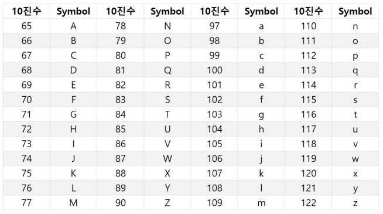

- 아스키 코드는 미국 ANSI에서 표준화한 정보교환용 7비트 부호체계이다. 아스키 코드는 총 128가지의 문자를 나타낼 수 있으며 각각의 문자를 나타내는 숫자값이 존재한다. 다음은 아스키 코드표의 일부를 나타낸 것이다. _<ord, chr>_




#### 1. 숫자의 의미

- 정수로 이루어진 list를 전달 받아, 각 정수에 대응되는 아스키 문자를 이어붙인 문자열을 반환하는 **get_secret_word** 함수를 작성하시오. 단, list는 65이상 90이해 그리고 97이상 122이하의 정수로만 구성되어 있다.

  ```
  get_secret_word([83, 115, 65, 102, 89]) #=> 'SsAfY'
  ```
  
  ```
  def get_secret_word(lst):
      word = '' #word 초기화
      for i in lst: 
          word += chr(i) #정수에 대응되는 아스키 문자를 변환해 word에 저장
      return word
  
  print(get_secret_word([83, 115, 65, 102, 89]))
  ```
  
  

#### 2. 내 이름은 몇일까?

- 문자열을 전달 받아 해당 문자열의 각 문자에 대응되는 아스키 숫자들의 합을 반환하는 **get_secret_number** 함수를 작성하시오. 단, 문자열은 A~Z, a~z로만 구성되어 있다.

  ```
  get_secret_number('tom') #=> 336
  ```
  
  ```
  def get_secret_number(word):
      number = 0 # number 초기화
      for i in word:
          number += ord(i) # 문자에 대응되는 아스키 숫자를 변환에 number에 저장
      return number
  
  print(get_secret_number('tom'))
  ```
  
  

#### 3. 강한 이름

- 문자열 2개를 전달 받아 두 문자열의 각 문자에 대응되는 아스키 숫자들의 합을 비교하여 더 큰 합을 가진 문자열을 반환하는 **get_strong_word** 함수를 작성하시오.

  ```
  get_strong_word('z', 'a') #=> 'z'
  get_strong_word('tom', 'john') #=> 'john'
  ```

  ```
  def get_strong_word(word1, word2):
      num_1 = 0 # word1의 아스키 숫자 합
      num_2 = 0 # word2의 아스키 숫자 합
      for i in word1:
          num_1 += ord(i) # word1 문자에 대응되는 아스키 숫자를 변환에 num_1에 저장
      for j in word2:
          num_2 += ord(j) # word2 문자에 대응되는 아스키 숫자를 변환에 num_2에 저장
      if num_1 > num_2: # num1이 num2보다 크면
          return word1 # word1 반환
      else:
          return word2
          
  print(get_strong_word('z', 'a')) 
  print(get_strong_word('tom', 'john')) 
  ```
  
  