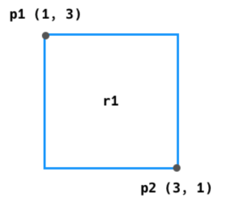

#### #. 도형 만들기

- 아래의 명세를 읽고 Python 클래스를 활용하여 점(Point)과 사각형(Retangle)을 표현하시오.


- **Point 클래스**에 대한 명세는 다음과 같다.

  | 인스턴스 변수 | 타입 | 설명  |
  | :------------ | ---- | ----- |
  | x             | int  | x좌표 |
  | y             | int  | y좌표 |

  | 메서드   | 매개변수       | 반환값(타입) | 설명                                                         |
  | -------- | -------------- | ------------ | ------------------------------------------------------------ |
  | (생성자) | x 좌표, y 좌표 | 없음         | 인스턴스가 생성될 때, 전달 받은 int 값들로 <br />인스턴스 변수 x와 y를 초기화 한다. |

- 예를 들어, 좌표 (4, 3)의 점은 아래와 같이 표현할 수 있다.

  ```
  p1 = Point(4, 3)
  ```

  

- **Rectangle 클래스**에 대한 명세는 다음과 같다.

  | 인스턴스 변수 | 타입           | 설명           |
  | :------------ | -------------- | -------------- |
  | p1            | Point 인스턴스 | 좌측 상단 좌표 |
  | p2            | Point 인스턴스 | 우측 하단 좌표 |

  | 메서드        | 매개변수                       | 반환값(타입)         | 설명                                                         |
  | ------------- | ------------------------------ | -------------------- | ------------------------------------------------------------ |
  | (생성자)      | Point 인스턴스, Point 인스턴스 | 없음                 | 인스턴스가 생성될 때, 2개의 Point 인스턴스를 전달 받아, 인스턴스 변수 p1과 p2를 초기화 한다. |
  | get_area      | 없음                           | 넓이(int)            | 사각형의 넓이를 계산하여 반환한다.                           |
  | get_perimeter | 없음                           | 둘레 길이 (int)      | 사각형의 둘레 길이를 계산하여 반환한다.                      |
  | is_square     | 없음                           | 정사각형 유무 (bool) | 사각형이 정사각형이면 True, 정사각형이 아니면 False를 반환한다. |

  

- 좌측 상단 좌표 (1, 3)과 우측 하단 좌표 (3, 1)의 점으로 만든 사각형을 그림으로 표현하면 다음과 같다.



```
p1 = Point(1, 3)
p2 = Point(3, 1)
r1 = Rectangle(p1, p2)

print(r1.get_area())
print(r1.get_perimeter())
print(r1.is_square())

p3 = Point(3, 7)
p4 = Point(6, 4)
r2 = Rectangle(p3, p4)

print(r2.get_area())
print(r2.get_perimeter())
print(r2.is_square())
```

```
class Point:
    def __init__(self, x, y):
        self.x = x
        self.y = y

class Rectangle:
    def __init__(self, p1, p2):
        self.p1 = p1
        self.p2 = p2

    def get_area(self):
        # 사각형의 넓이 계산 : abs(x1-x2) * abs(y1-y2)
        return  abs(self.p1.x - self.p2.x) * abs(self.p1.y - self.p2.y)

    def get_perimeter(self):
        # 사각형의 둘레 길이 계산 : (abs(x1-x2) + abs(y1-y2)) * 2
        return (abs(self.p1.x - self.p2.x) + abs(self.p1.y - self.p2.y)) * 2

    def is_square(self):
        # 정사각형은 가로의 길이와 세로의 길이가 같다 : abs(x1-x2) == abs(y1-y2)
        if abs(self.p1.x - self.p2.x) == abs(self.p1.y - self.p2.y):
            return True
        else:
            return False
```

```
class Point:
    def __init__(self, x, y):
        self.x = x
        self.y = y

class Rectangle:
    sq_width = 0
    sq_length = 0

    def __init__(self, p1, p2):
        self.p1 = p1
        self.p2 = p2
        Rectangle.sq_width = abs(self.p1.x - self.p2.x) # 사각형 가로의 길이
        Rectangle.sq_length = abs(self.p1.y - self.p2.y) # 사각형 세로의 길이

    def get_area(self):
        # 넓이 = 가로 * 세로
        return Rectangle.sq_width * Rectangle.sq_length

    def get_perimeter(self):
        # 길이 = (가로 + 세로) * 2
        return (Rectangle.sq_width + Rectangle.sq_length) * 2

    def is_square(self):
        # 정사각형 : 가로의 길이 == 세로의 길이
        if Rectangle.sq_width == Rectangle.sq_length:
            return True
        else:
            return False
```

