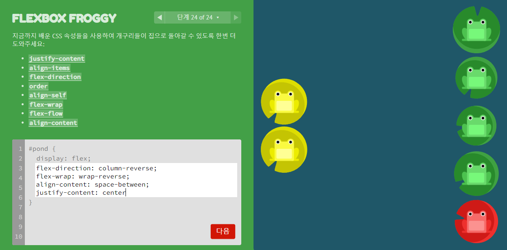
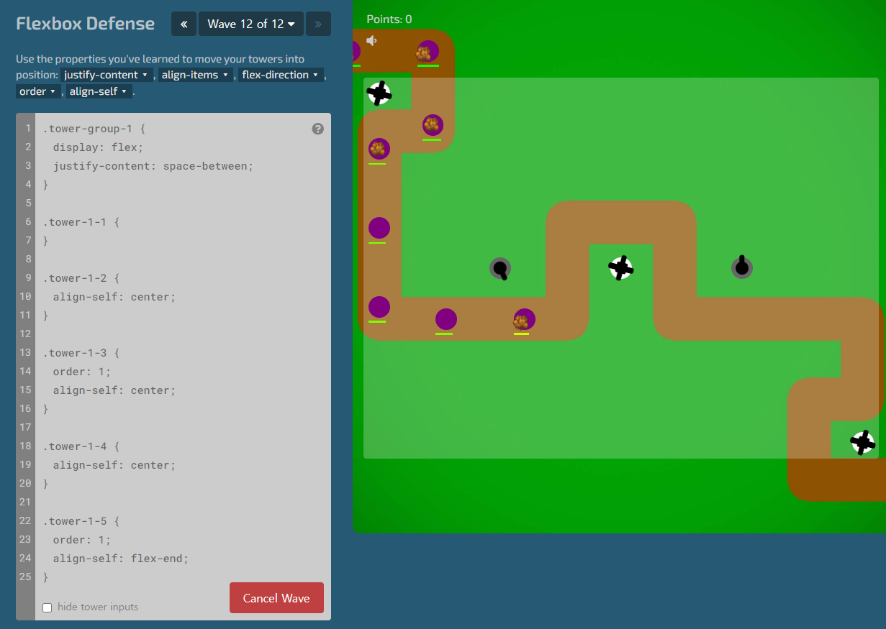

### 1. FLEXBOX FROGGY




### 2. Flexbox Defense




### 3. Responsive Web

- 제공된 이미지 01_result.png, 02_result.png, 03_result.png를 참고하여 shop.html과 shop.css를 작성하시오.

  1. 각 요소 (nav, section, article, footer)는 주어진 코드의 주석에 맞춰 작성합니다.
  2. 모든 이미지 요소는 images 폴더에 담긴 이미지 파일을 활용합니다.
  3. 네비게이션 바는 항상 브라우저 화면 최상단에 고정되어 있습니다.
  4. 상품 정보가 담긴 카드들은 다음의 조건을 따릅니다. 각 카드들은 어느 곳으로도 이동하지 않지만, hyper link의 형태를 띕니다.
     - Viewport 너비가 768px 미만인 경우, 행당 1개의 카드가 제시됩니다. 
     - 너비가 768px 이상, 992px 미만인 경우, 행당 2개의 카드가 제시됩니다. 
     - 너비가 992px 이상인 경우, 행 당 4개의 카드가 제시됩니다.
  5. Footer의 아이콘을 클릭하면 해당하는 SNS의 메인 페이지로 이동합니다.

  

```
<!DOCTYPE html>
<html lang="en">
<head>
  <meta charset="UTF-8">
  <meta name="viewport" content="width=device-width, initial-scale=1.0">
  <link rel="stylesheet" href="shop.css">
  <link href="https://cdn.jsdelivr.net/npm/bootstrap@5.1.3/dist/css/bootstrap.min.css" rel="stylesheet" integrity="sha384-1BmE4kWBq78iYhFldvKuhfTAU6auU8tT94WrHftjDbrCEXSU1oBoqyl2QvZ6jIW3" crossorigin="anonymous">
  <title>Title</title>
</head>
<body>
  <!-- nav -->
  <nav class="d-flex justify-content-between align-items-center sticky-top p-3 bg-light">
    <h5 class="fw-bold">SAMSUNG</h5>
    <div>
      <a class="text-decoration-none text-dark me-3 fw-bold" href="">Contact</a>
      <a class="text-decoration-none text-dark me-3 fw-bold" href="">Cart</a>
      <a class="text-decoration-none text-dark me-3 fw-bold" href="">Login</a>
    </div>
  </nav>

  <div class="container">
    <!-- section -->
    <section>
      
    </section>

    <!-- article -->
    <article>
      <h5 class="text-center fw-bold m-5">Our New Products</h5>
      
      <div class="row row-cols-1 row-cols-md-2 row-cols-lg-4 g-4">
        
        <a href="#" class="col text-decoration-none">
          <div class="card">
            
            <div class="card-body">
              <p class="card-text text-center fw-bold text-black">Buds<br>179,000</p>
            </div>
          </div>
        </a>

        <a href="#" class="col text-decoration-none">
          <div class="card">
            
            <div class="card-body">
              <p class="card-text text-center fw-bold text-black">Buds<br>179,000</p>
            </div>
          </div>
        </a>

        <a href="#" class="col text-decoration-none">
          <div class="card">
            
            <div class="card-body">
              <p class="card-text text-center fw-bold text-black">Buds<br>179,000</p>
            </div>
          </div>
        </a>

        <a href="#" class="col text-decoration-none">
          <div class="card">
            
            <div class="card-body">
              <p class="card-text text-center fw-bold text-black">Buds<br>179,000</p>
            </div>
          </div>
        </a>
      </div>
    </article>

    <!-- footer -->
    <footer class="d-flex justify-content-center align-items-center">
      <a href="https://www.instagram.com" class="mx-2 my-5">
        
      </a>
      <a href="https://www.facebook.com" class="mx-2 my-5">
        
      </a>
      <a href="https://www.twitter.com" class="mx-2 my-5">
        
      </a>
    </footer>
  </div>
  <script src="https://cdn.jsdelivr.net/npm/bootstrap@5.1.3/dist/js/bootstrap.bundle.min.js" integrity="sha384-ka7Sk0Gln4gmtz2MlQnikT1wXgYsOg+OMhuP+IlRH9sENBO0LRn5q+8nbTov4+1p" crossorigin="anonymous"></script>
</body>
</html>
```

